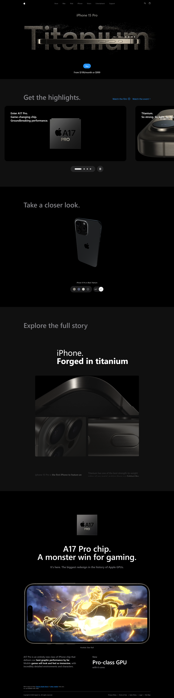
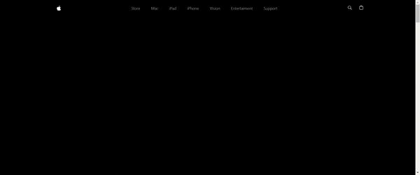
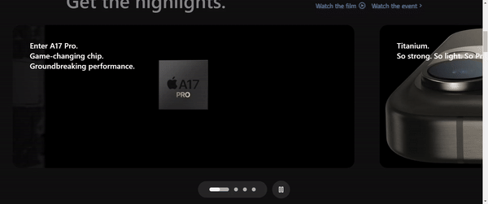

# Portfolio Project - iPhone 15 website

## Table of contents

- [Portfolio Project - iPhone 15 website](#portfolio-project---iphone-15-website)
  - [Table of contents](#table-of-contents)
  - [Overview](#overview)
    - [Screenshots](#screenshots)
      - [Desktop](#desktop)
    - [Links](#links)
    - [Built with](#built-with)
    - [Continued development](#continued-development)
  - [Author](#author)

## Overview

iPhone 15 website clone

### Screenshots

#### Desktop

### Links

- GitHub Repo: [View Repo](https://github.com/Gandah/apple-web.git)
- Live Site URL: [Visit Site](./)

### Built with

- React
- GSAP animations
- Vite
- [Tailwind Css](https://tailwindcss.com/) - Css framework
- Docker
- Sentry

### Continued development

- Add more sections

## Author

- Website - [Porfolio]( https://gandah-porfolio.vercel.app/)
- LinkedIn - [MyLinkedIn](https://www.linkedin.com/in/gandahkelvin)
